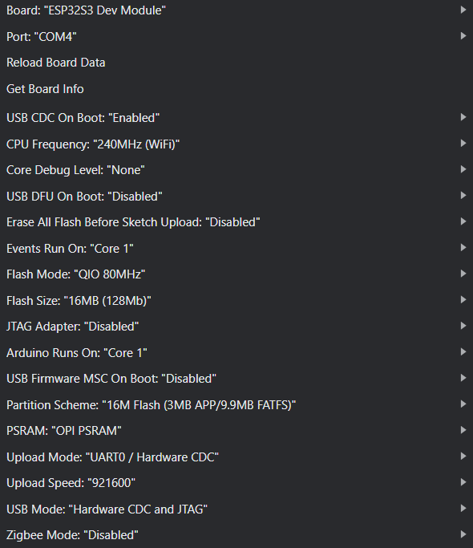

# EEZ Studio Starter Template for LILYGO T-Display-S3 AMOLED (Plus)

This project contains a basic template for integrating EEZ Studio user interfaces (created with the LVGL template) with the LILYGO T-Display-S3 AMOLED. The template supports both the Arduino IDE and PlatformIO. It is designed to be a starting point for your projects, allowing you to quickly set up a development environment for the LILYGO T-Display-S3 AMOLED.

## Supported Boards

This template has been primarily developed and tested with the LILYGO T-Display-S3 AMOLED Plus model (including touch screen and enclosure). While it should be compatible with other models in the AMOLED series, some configuration adjustments may be necessary. For specific details about other models, please consult the official [LILYGO AMOLED Series repository](https://github.com/Xinyuan-LilyGO/LilyGo-AMOLED-Series).

## How to use (general instructions)

1. If you haven't done so already, create a new EEZ Studio project using the LVGL template. Add all the necessary UI elements and screens you want to use in your project. Make sure to test the UI in the EEZ Studio simulator to ensure everything works as expected.
2. Click the build button in EEZ Studio to generate the UI code. This will create a folder named `ui` in your project directory (most likely inside the `src` folder), containing all the necessary files for your UI.
3. Copy the files from the `ui` folder into the `libraries/ui` folder of this template. This will allow the Arduino IDE or PlatformIO to access the UI code.

## Running the project (Arduino IDE)

1. If using the Arduino IDE, open the `T-Display-S3-AMOLED-Plus.ino` file in the root directory of this template and set the Sketchbook location to the root directory of this template. This will ensure that the Arduino IDE can find the libraries and files needed for your project.
2. Open the Arduino IDE and select the appropriate board (LILYGO T-Display-S3 AMOLED Plus) and port. Then set the board settings as follows:
   | Setting | Value |
   |---------|--------|
   | **Board** | ESP32S3 Dev Module |
   | **Port** | _your port_ |
   | USB CDC On Boot | Enabled |
   | CPU Frequency | 240MHz (WiFi) |
   | Core Debug Level | None |
   | USB DFU On Boot | Disabled |
   | Erase All Flash Before Sketch Upload | Disabled |
   | Events Run On | Core 1 |
   | Flash Mode | QIO 80MHz |
   | **Flash Size** | 16MB (128MB) |
   | JTAG Adapter | Disabled |
   | Arduino Runs On | Core 1 |
   | USB Firmware MSC On Boot | Disabled |
   | **Partition Scheme** | 16M Flash (3MB APP/9.9MB FATFS) |
   | **PSRAM** | OPI PSRAM |
   | **Upload Mode** | UART0 / Hardware CDC |
   | Upload Speed | 921600 |
   | **USB Mode** | Hardware CDC and JTAG |
   | Zigbee Mode | Disabled |

    

    
Screenshot of the settings from Arduino IDE v2.3.4

        
    

   For more detailed instructions please refer to the [LILYGO documentation](https://github.com/Xinyuan-LilyGO/LilyGo-AMOLED-Series).

3. Now you can upload the code to your board. Make sure to select the correct COM port for your board.

Everything shuold be set up and ready and you should see the EEZ Studio UI running on your LILYGO T-Display-S3 AMOLED (Plus).

If you are asked to upgrade any libraries, do not upgrade LVGL, as the LILYGO library depends on a specific version of LVGL. Upgrading it may cause compatibility issues.

For any board that is not in the LILYGO AMOLED series, you may need to adjust the `lv_conf.h` file to match the display resolution and other settings or potentially use different libraries. Please refer to the documentation of the specific board you are using for more information.

## Running the project (PlatformIO)

1. If using PlatformIO, make sure you have the PlatformIO extension installed in your IDE (e.g., Visual Studio Code) and select the correct COM port for your board (if the board is not automatically detected).

Everything should be set up and ready to go. You can now start developing your project using the EEZ Studio UI and the LILYGO T-Display-S3 AMOLED Plus.
If you use another model, you may need to adjust the configuration settings in the `platformio.ini` file or the `T-Display-S3-AMOLED-Plus.ino` file to match your specific board.

For any board that is not in the LILYGO AMOLED series, you may need to adjust the `lv_conf.h` file to match the display resolution and other settings or potentially use different libraries. Please refer to the documentation of the specific board you are using for more information.

## Notes

- The template is designed to be a starting point for your projects. You can customize the UI and functionality as needed.
- The template includes basic functionality for the LILYGO T-Display-S3 AMOLED Plus, but you may need to add additional features or modify the code to suit your specific project requirements.
- The template is compatible with both the Arduino IDE and PlatformIO, allowing you to choose your preferred development environment. Please note that from my testing it seems that the Arduino IDE is more reliable (but also slower) than PlatformIO for this project, but both should work fine.

## Credits and useful resources:

- [EEZ Studio](https://eezstudio.com/) - A powerful tool for creating user interfaces for embedded systems.
- [LVGL](https://lvgl.io/) - A free and open-source graphics library for embedded systems.
- [LILYGO examples and libraries](https://github.com/Xinyuan-LilyGO/LilyGo-AMOLED-Series) - The official repository for the LILYGO AMOLED series, containing examples and libraries for various models. Thanks to the extensive examples and easy-to-use libraries, creating this template was made possible.
